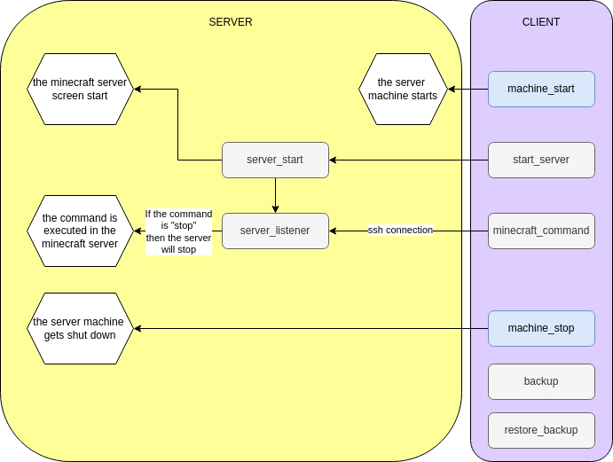

# Install
## Prerequisite

Have a linux server hosted somewhere with:
- minimum of 8G RAM, 6 CPU, 1Gbps, 100G disk size
- fixed public IP
- specific port open (if some firewall special settings are necessary), usually 25565 for the server and here 56552 for communication with the server

## For OVH
- Create ssh key pair, add the public to OVH and the private in sshkey/
- Create instance (by default fixed IP) b3-32 or b3-64
- Create API token for app and copy the credentials in credentials_ovh.yaml

## Client
- Clone the git on the client
- Fill the params.sh
- If the host is OVH, fill the credentials_ovh.yaml 
- [Download](https://files.minecraftforge.net/net/minecraftforge/forge) the installer and put it in server/
- Change the path in minecraft_server.service to fit the user and workding directory

## Server
- Connect to the server with sftp and copy all files
```bash
sftp ubuntu@ipofyourmachine
put *
```
- Setup the machine (opens the right ports)
```bash
sudo bash server_setup.sh
```
- Install the minecraft server
```bash
bash server_install.sh
```
Instead of server_install you can also restore_backup to restore a server.

# Usage

Use machine_start.py to start the virtual machine, which will start automatically the minecraft server.
```bash
pixi shell
python machine_start.py
exit
```
To inject commands in the server, use minecraft_command.
```bash
bash minecraft_command.sh "time set 0"
```
If "stop" is used then the server will stop.

After having stopped the server, shutdown the machine:
```bash
pixi shell
python machine_stop.py
exit
```

# Framework


# Links
[The minecraft forge server](https://files.minecraftforge.net/net/minecraftforge/forge/) (use the version you need for your mods)

[A good place to find mods](https://www.curseforge.com/minecraft) (Careful look for which version it is available, and which dependencies it has)

# Potential improvements

- API scripts for other providers
