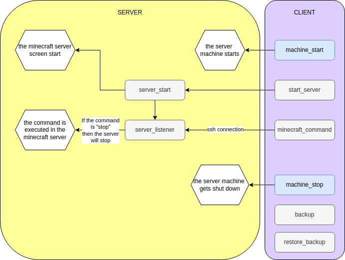

# Install
## Prerequisite

Have a linux server hosted somewhere with:
- minimum of 8G RAM, 6 CPU, 1Gbps, 100G disk size
- fixed public IP
- specific port open (firewall settings), usually 25565

The client side start script will depend on the host API. It just needs to start the virtual cloud machine and the server will launch on startup.

## For OVH
- Create ssh key pair and add the public to OVH
- Create instance (by default fixed IP) b3-32 or b3-64
- Create API token

## Client
- Clone the git on the client
- Fill the params.sh
- If the host is OVH, fill the client_ovh_credentials 

## Server
- Clone the git on the server
- install java 
```bash
sudo apt install openjdk-21-jre
```
- [Download](https://files.minecraftforge.net/net/minecraftforge/forge) and launch the installer
```bash
java -jar forge-1.21.4-54.1.0-installer.jar --installServer
```
- Change the "false" to "true" in the eula.txt
- Fill the params.sh
- Modify the minecraft_server.service to have the right filepaths then copy it to /etc/systemd/system/minecraft_server.service. Then run: 
```bash
sudo systemctl daemon-reload
sudo systemctl enable minecraft_server.service
```
Now it will automatically start the server when the instance is started.
- Add the server_shutdown.sh to the crontab (every minutes, or 5 minutes)


# Usage

Use client_start.sh on your local computer. 
To put commands in the server, use client_command. And when done send the "stop" command. 

## Parameters

Remove or add people to black and whitelists, add more memory in start_server.sh, 

# Framework


# Links
[The minecraft forge server](https://files.minecraftforge.net/net/minecraftforge/forge/) (use the version you need for your mods)

[A good place to find mods](https://www.curseforge.com/minecraft) (Careful look for which version it is available, and which dependencies it has)

# Todo

- rename scripts
- setup script
- backup
- API for other providers
